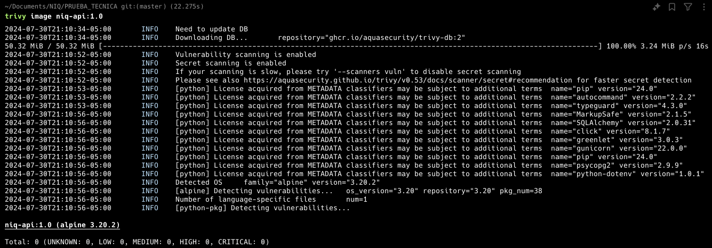

# NIQ

## Table of Contents

1. [**Before All**](#before-all)
   - [Dotenv Files ⚙️](#dotenv-files-⚙️)
2. [**Development 💻**](#development-💻)
3. [**Just Dockerfiles 🐋**](#just-dockerfiles-🐋)
4. [**Docker Compose 🐳**](#docker-compose-🐳)
5. [**Kubernetes ⚓**](#kubernetes-⚓)
   - [Setup Env Variables](#setup-env-variables)
   - [Create Resources](#create-resources)
   - [Deploy Services](#deploy-services)
6. [**Some Extras :D**](#some-extras-d)
7. [**Possible Improvements**](#possible-improvements)


## BEFORE ALL

> All the comands must be run in the root of the project

### DOTENV FILES ⚙️

As you can see all the comands must be run with a parameter pointing to a envfile, for consistency pls leave your env files in the folder called envs, there is a template that holds the env variables but you neet to change its names to `api.env` and `psql.env` 

## DEVELOPMENT 💻

For development you need to adjust a virtual environment activate it and then just run 

```bash
#install dependencies
pip install -r app/requirements.txt

#run app
python app/main.py
```

## JUST DOCKERFILES 🐋

For deploying using just plain docker containers you need to do this steps

```bash
#Create the volume for postgres
docker volume create postgres_data

#Create a network for our containers
docker network create niq-net

#First create the postgres container
docker run --name some_postgres --env-file psql.env -d --net niq-net -v postgres_data:/var/lib/postgresql/data postgres:16


#Build the image of our app
docker build -t niq-api:1.0 -f docker/Dockerfile .
#run the api image
docker run --name flask-api --net niq-net --env-file app/.env -p 8080:8080 test-flask-api

```


## DOCKER COMPOSE 🐳

Here it will initialize all the services by itself

```bash
docker compose -f ./docker/docker-compose.yml --env-file envs/api.env --env-file envs/psql.env  up --build
```
## KUBERNETES ⚓

For this part you need to follow some steps to get our services up and running.

> ⚠️ Be sure that the image of the api is available

<a id="setup-env-variables"></a>
Setup env variables runing the bash script, it generates the secrets.yml file with the base64 encoded secrets (dont worry it doesnt uploads to git 😉) 

```bash
./misc/generate_base64.sh
```
<a id="create-resources"></a>
Create the necessary resources

```bash
#namespace junior-test
kubectl apply -f k8s/utils/namespace.yml

#Configmap for nginx from the one we already created
kubectl create configmap nginx-config --from-file=nginx.conf=nginx/nginx.conf --namespace=junior-test

# persistent volume claim for postgres data
kubectl -f k8s/utils/postgres-pvc.yml

#secrets
kubectl apply -f k8s/utils/secrets.yml

```
<a id="deploy-services"></a>
Now just run our app and the services

```bash
#First the DB
kubectl apply -f k8s/deployments/db-deployment.yml
kubectl apply -f k8s/services/db-service.yml

# now the api

kubectl apply -f k8s/deployments/api-deployment.yml
kubectl apply -f k8s/services/api-service.yml

#And finally the nginx

kubectl apply -f k8s/deployments/nginx-deployment.yml
kubectl apply -f k8s/services/nginx-service.yml
```
## SOME EXTRAS :D
As you can see we used trivy for scanning the image of our app and it appears to be just right




# POSSIBLE IMPROVEMENTS

* Add SSL (maybe with certbot)
* Add Some CI/CD for the images and put the diferrent checks in there
* Add some security checks and logging options to the src
* Upload the secrets to some cloud service like Parameter Store in AWS
